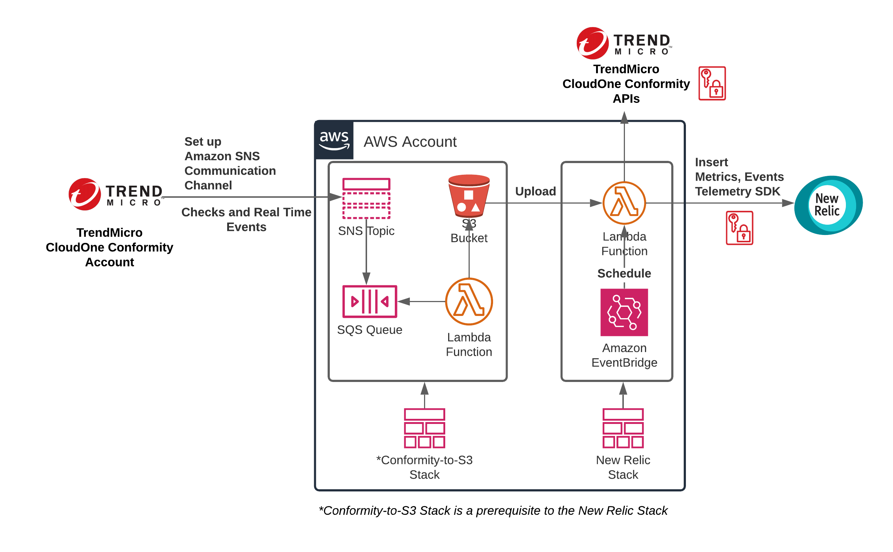
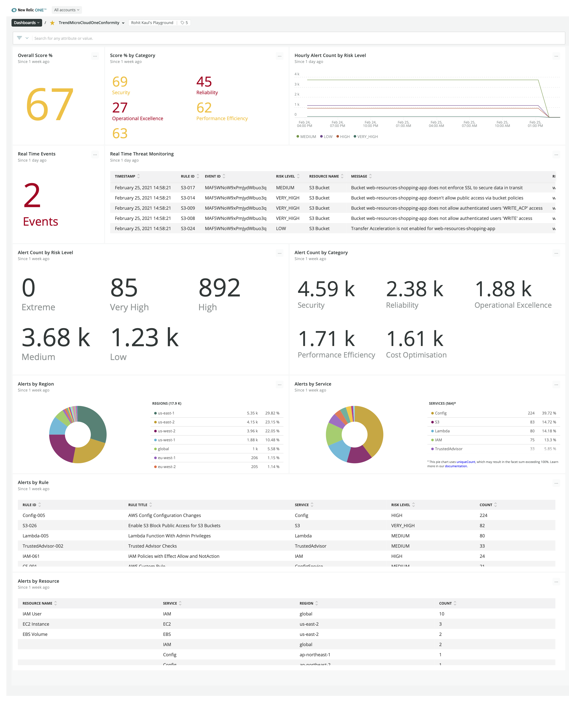

# New Relic connector for Trend Micro Cloud One Conformity

>The project integrates [Trend Micro Cloud One Conformity](https://www.trendmicro.com/en_us/business/products/hybrid-cloud/cloud-one-conformity.html) ("Conformity") with [New Relic](https://newrelic.com/) when using the [AWS integration](https://www.cloudconformity.com/help/conformity-bot/aws-integration.html). The "solution" (aka "integration" or "connector") relies on [Amazon SNS](https://www.cloudconformity.com/help/communication/communication-channels/amazon-sns-communication.html) integration offered by Conformity. With this solution, you will complement your AWS observability by adding in Conformity's AWS Well-Architected and compliance views for your workloads running on AWS, right next to your larger single-pane-of-glass using New Relic for all your observability needs.

> The solution is developed and deployed using the [serverless framework](https://www.serverless.com/open-source/) and deploys a AWS CloudFormation stack in your account. It requires that you’ve deployed the [Conformity-to-S3](https://github.com/raphabot/Conformity-to-S3) solution beforehand.

## Installation

> Make sure the following requirements are met:
> * You have access to an AWS account where you can deploy this solution. If you don't have an AWS account, you can [sign up for free tier](https://aws.amazon.com/free).
> * You have access to a Trend Micro Cloud One account with Conformity subscription. Make sure you [add your AWS account to Conformity](https://www.cloudconformity.com/help/add-cloud-account/add-an-aws-account.html). If you don't already have a Cloud One account, you can [sign up](https://cloudone.trendmicro.com/) for a new account that includes a 30-day free trial.
> * You have access to a New Relic account. Make sure you [add your AWS account to New Relic](https://docs.newrelic.com/docs/integrations/amazon-integrations/get-started/connect-aws-new-relic-infrastructure-monitoring). If you don’t already have a New Relic account, you can sign up for a free account in the [AWS Marketplace](https://aws.amazon.com/marketplace/pp/B08L5FQMTG).

> Deploy [Conformity-to-S3](https://github.com/raphabot/Conformity-to-S3) solution to your AWS account before you deploy this solution. The quickest way to do so is by using this AWS CloudFormation [template](https://github.com/raphabot/Conformity-to-S3/releases/latest/download/ConformityToS3Stack.template.json).

> Enable Amazon SNS communication from your Conformity account to your linked AWS account, using the Amazon SNS Topic that the "Conformity-to-S3" solution deploys for you. You can find the Topic ARN by looking up the "TopicARN" [output](https://github.com/raphabot/Conformity-to-S3#outputs) from the AWS CloudFormation Stack that the "Conformity-to-S3" solution was deployed under.

> Be sure to add the necessary information to the  configuration file `config.dev.yml` in the project root directory. Replace the placeholders (in chevrons) with actual values. If you choose to fork this repository, do not commit this file as it holds sensitive information about your Trend Micro and New Relic accounts.

> Make sure you've set up [AWS Command Line Interface](https://aws.amazon.com/cli/) (AWS CLI) in your machine or build host from where you plan to deploy this solution.

> Make sure you've installed the latest version of [serverless](https://www.serverless.com/framework/docs/getting-started/) CLI.

> You need to have [Docker](https://docs.docker.com/install/) installed, along with [Python 3](https://www.python.org/downloads/).

> Initialize the node modules by running this command from the project root directory:
 `npm install`

## Deployment

> Deploy the solution using serverless CLI by running the following command. If you have [AWS CLI profile](https://docs.aws.amazon.com/cli/latest/userguide/cli-configure-profiles.html) set up, include `–-profile <PROFILE_NAME>`.

> `sls deploy`

> This deploys the solution using the configuration defined in [config.dev.yml](config.dev.yml) file in the `us-east-1` Region of your AWS account, by default. You can specify the AWS account and Region by setting up your AWS CLI Profile on your machine or build host. You must deploy this solution in the same account and Region where you deployed the "Conformity-to-S3" solution.

## Getting Started
Here's the solution's deployment architecture in your AWS environment.

Once the solution is deployed to your AWS account, you should start to see the custom event named `TMCloudOneConformityEvent` reported into your New Relic account using [Data Explorer](https://docs.newrelic.com/docs/query-your-data/explore-query-data/explore-data/introduction-data-explorer).

You can then build a [dashboard](https://docs.newrelic.com/docs/query-your-data/explore-query-data/dashboards/introduction-dashboards) in your New Relic account to keep tabs on your AWS account checks reported by Conformity. Following is an illustrative New Relic dashboard for Trend Micro Cloud One Conformity  ("Conformity dashboard") that enables you to gain insights into Conformity reported events for your linked AWS account(s).

To create the Conformity dashboard into your New Relic account, follow these steps:

1. Review the contents of the file: [create-dashboard-mutation.txt](dashboard/create-dashboard-mutation.txt). Replace all placeholders marked `<NEW_RELIC_ACCOUNT_ID>` with your [New Relic Account ID](https://docs.newrelic.com/docs/accounts/accounts-billing/account-setup/account-id/). This file contains the payload for the NerdGraph mutation that creates the Conformity dashboard in your New Relic account. NerdGraph is [New Relic’s unified API in a GraphQL](https://docs.newrelic.com/docs/apis/nerdgraph/get-started/introduction-new-relic-nerdgraph/) flavor.

2. Navigate to New Relic's [NerdGraph GraphiQL explorer](https://docs.newrelic.com/docs/apis/nerdgraph/get-started/introduction-new-relic-nerdgraph/#explorer)

3. Create the dashboard by providing the payload for the [mutation](https://graphql.org/learn/queries/#mutations) in the GraphiQL explorer.

4. Navigate to the dashboard in your New Relic account by searching for it by name, i.e. "TrendMicroCloudOneConformity". To access dashboards, go to your [New Relic account](http://one.newrelic.com/) and click on "Dashboards" on the top navigation menu.

## Support

New Relic hosts and moderates an online forum where customers can interact with New Relic employees as well as other customers to get help and share best practices.

## Contributing
We encourage your contributions to improve New Relic connector for Trend Micro Cloud One Conformity! Keep in mind when you submit your pull request, you'll need to sign the CLA via the click-through using CLA-Assistant. You only have to sign the CLA one time per project.
If you have any questions, or to execute our corporate CLA, required if your contribution is on behalf of a company,  please drop us an email at opensource@newrelic.com.

**A note about vulnerabilities**

As noted in our [security policy](../../security/policy), New Relic is committed to the privacy and security of our customers and their data. We believe that providing coordinated disclosure by security researchers and engaging with the security community are important means to achieve our security goals.

If you believe you have found a security vulnerability in this project or any of New Relic's products or websites, we welcome and greatly appreciate you reporting it to New Relic through [HackerOne](https://hackerone.com/newrelic).

## License
New Relic connector for Trend Micro Cloud One Conformity is licensed under the [Apache 2.0](http://apache.org/licenses/LICENSE-2.0.txt) License.
